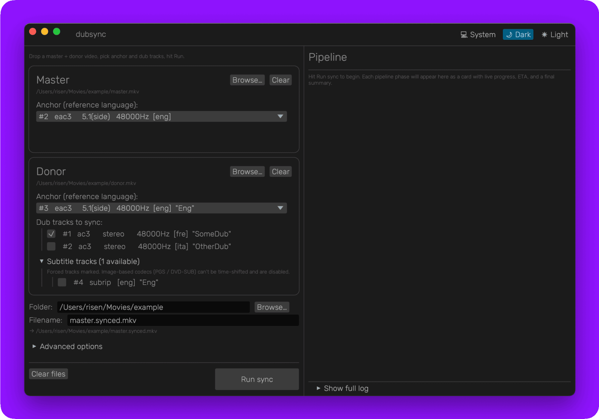

<p align="center">
  
</p>

<h1 align="center">dubsync</h1>

<p align="center">
  Sync localized dub tracks from a lower-quality donor release (e.g. 720p Web-DL) onto a high-quality master video (e.g. 4K Blu-ray) using FFT-based audio cross-correlation.
</p>

<p align="center">
  <a href="https://github.com/risenxxx/dubsync/releases/latest"></a>
  <a href="https://github.com/risenxxx/dubsync/actions/workflows/ci.yml"></a>
  
  
</p>

Both releases must share an "anchor" track in the same language (typically English).
`dubsync` correlates the two anchors **once** to derive a piecewise Time Offset Map,
then applies that map to every selected donor dub. Each segment boundary is snapped
into a moment when the master is silent (so the splice is invisible behind a quiet
scene transition), with optional ambient gap-filling via the `rubberband` time-
stretcher when the dub itself has continuous music or room-tone you don't want
interrupted.

<p align="center">
  
</p>

## Installation

### From release (recommended)

Download the latest archive for your platform from the [Releases page](https://github.com/risenxxx/dubsync/releases):

- **Windows installer** — `dubsync-setup-vX.Y.Z.exe` (Inno Setup, Start-Menu shortcut, optional desktop icon, per-user install — no admin elevation required).
- **Windows portable** — `dubsync-vX.Y.Z-x86_64-pc-windows-msvc.zip` (extract anywhere, run `dubsync-gui.exe` or `dubsync.exe`).
- **macOS (Apple Silicon)** — `dubsync-vX.Y.Z-aarch64-apple-darwin.dmg`. **Not signed with a Developer ID** — see "Installing on macOS" below for the one-time Gatekeeper bypass.
- **Linux** — `dubsync-vX.Y.Z-x86_64-unknown-linux-gnu.tar.gz` (CLI only; build the GUI locally with `cargo build --release --features gui`).

Each archive bundles:

- `dubsync` / `dubsync.exe` — CLI binary.
- `dubsync-gui` / `dubsync-gui.exe` — desktop GUI with drag-and-drop, persistent selections, live progress (Windows release; Linux users build from source).
- `ffmpeg` + `ffprobe` (BtbN LGPL build on Windows/Linux, Homebrew on macOS) — required at runtime.
- `rubberband` — used by the optional `--smooth-gaps` mode. Windows: ships with `sndfile.dll` next door (rubberband links it dynamically). macOS: every dylib dependency is bundled inside the `.app` and rewritten to `@executable_path/...` so no Homebrew is required on the target machine. Linux: dynamically linked against `libsndfile1` and `libsamplerate0` from your distro (preinstalled on most desktops; `apt install libsndfile1 libsamplerate0` if missing).
- `FFMPEG-LICENSE.txt` (LGPL) and `RUBBERBAND-LICENSE.txt` (GPL-2.0+).

Extract anywhere and run — no Rust toolchain, no separate ffmpeg/rubberband install required.

#### Installing on Windows

The installer and portable archive are **not signed with a code-signing
certificate**. Windows SmartScreen (and sometimes Defender's heuristic scanner)
will warn on first launch. You only need to clear this once per file:

1. Download `dubsync-setup-vX.Y.Z.exe` (or the portable `.zip`) from the
   [Releases page](https://github.com/risenxxx/dubsync/releases).
2. If Edge / Chrome warns *"can harm your device"* when downloading, click
   **Keep** → **Keep anyway** (or **Show more → Keep** in newer Edge).
3. Double-click the installer. SmartScreen shows *"Windows protected your PC"*.
   Click **More info** → **Run anyway**.
4. Walk through the Inno Setup wizard normally. Subsequent launches work without
   warnings.

If Defender quarantines the file outright as a generic `Trojan:Win32/Wacatac` or
similar heuristic detection (a known false positive for unsigned Rust/eframe
binaries), restore it from **Windows Security → Protection history** and add an
exclusion for the install folder.

#### Installing on macOS

The `.dmg` is **not signed with an Apple Developer ID** (and not notarized). On
first launch macOS Gatekeeper will refuse to open the app with a *"Apple could
not verify..."* dialog. You only need to do this once:

1. Open the `.dmg`, drag `Dubsync.app` into `/Applications`.
2. Double-click `Dubsync.app` — Gatekeeper blocks it. Click **Done**.
3. Open **System Settings → Privacy & Security**, scroll to the bottom. You will
   see a line saying *"Dubsync was blocked to protect your Mac"* with an
   **Open Anyway** button. Click it, confirm with Touch ID or your password.
4. Subsequent launches work normally with a double-click.

(If you prefer the terminal route: `xattr -cr /Applications/Dubsync.app`
strips the quarantine attribute in one shot.)

### From source

```sh
cargo install --path .                     # installs `dubsync` (CLI)
cargo build --release --features gui        # also produces `dubsync-gui`
```

Requirements:

- Rust 1.75+
- `ffmpeg` and `ffprobe` on `PATH` (Homebrew, apt, choco) — required.
- `rubberband` on `PATH` — required only if you use `--smooth-gaps`.

`dubsync` looks for these binaries next to its own executable first (so the
distributed archives just work), then falls back to `PATH`.

## Usage

### Desktop GUI

Drag a master + donor file onto labelled drop zones, pick anchor + dub tracks,
choose an output folder + filename, click **Run**. Selections persist across
sessions, so re-running on the next episode of a series is a one-click operation.

The right-hand pane shows a **chat-style pipeline timeline** — one card per phase
(extract → fps-normalize → correlate → splice → remux) with live progress bars
and an ETA. A final summary card lists the offset-map stats (segments, anchors
kept, largest jump, total silence inserted, FPS handling, output path). The full
raw `tracing` log is available under "Show full log" if you want the underlying
ffmpeg invocations.

The donor zone has a collapsible **"Subtitle tracks"** picker showing every
text-based donor sub for explicit selection. Image-based codecs (PGS / DVD-SUB)
are shown as disabled with an explanation tooltip — they need OCR to time-shift,
which is out of scope.

### Interactive CLI

```sh
dubsync
```

Walks you through file selection, uses `ffprobe` to list audio tracks in each file,
and presents pickers for the master anchor, donor anchor, and dub multi-select.
After the basic flow, an **opt-in Advanced options** prompt covers everything that
doesn't fit the main flow — subtitle pass-through + donor sub picker, output
codec/bitrate, FPS handling mode, workflow modes (anchor-only validation, solo-dub,
diagnostic anchor swap), report file path, and a nested "Tune correlation/splice
parameters?" sub-gate for the rare numeric knobs. Every prompt is pre-filled with
the current default, so Enter accepts.

A copy-pasteable headless command is printed at the end so you can re-run with the
same selection without going through the prompts again.

### Headless

```sh
dubsync \
  --master-file /path/master.mkv \
  --donor-file /path/donor.mkv \
  --master-anchor-track 1 \
  --donor-anchor-track 1 \
  --donor-dub-tracks 2,3,4 \
  --output-file /path/out.mkv
```

Stream indices come from `ffprobe -show_streams <file>`.

### Common recipes

**Cast a single dub to a TV** — output one audio track so the TV auto-plays it
instead of defaulting to English:

```sh
dubsync ... --donor-dub-tracks 5 --solo-dub --output-file cast.mkv
```

**Verify the offset map is correct** — replace the master English with the synced
donor English so you can A/B against master video lips:

```sh
dubsync ... --include-donor-anchor
```

If the diagnostic English track drifts against the master video, the *boundaries* are
wrong (not the dubs).

**Smooth audible gaps with stretched ambient** — when the dub has continuous music
or room-tone that gets interrupted by the inserted silence at splices:

```sh
dubsync ... --smooth-gaps true
```

Off by default. Speech is never stretched: the splicer probes the neighbour buffer
on each side of the gap and falls back to literal silence if either side is dialog,
preserving lip-sync.

**Anchor-only validation** — confirm the offset map is correct before committing
to a full multi-dub run. Outputs an MKV with *only* the synced donor anchor so you
can A/B against the master video lips:

```sh
dubsync ... --anchor-only-validation --output-file validate.mkv
```

`--donor-dub-tracks` becomes optional in this mode — only the anchor is processed.

**Override the output audio codec** — `eac3` is the default (matches the typical
donor and plays back natively on TVs / AVRs over HDMI). Switch to `flac` for a
lossless re-encode or for 7.1 sources, `ac3` for maximum S/PDIF-bitstream
compatibility with older receivers, or `aac` for the smallest stereo files:

```sh
dubsync ... --dub-codec flac                 # lossless, 2–3× larger
dubsync ... --dub-codec ac3                  # AC3 5.1 → 640 kbps auto
dubsync ... --dub-codec aac --dub-bitrate 192
```

`ac3` and `eac3` are capped at 6 channels — for a 7.1 source dubsync rejects the
config upfront and tells you to use FLAC.

**Save a report file** — HTML / CSV / JSON describing the offset map, segment table,
splice strategy decisions, and run summary:

```sh
dubsync ... --report run.html                # styled HTML
dubsync ... --report run.csv                 # spreadsheet-ready
dubsync ... --report run.json                # structured JSON dump
```

A high-level run summary always prints to stderr regardless of `--report` (and
appears as a final card in the GUI).

**Override the auto fps-stretch** — when the donor's `r_frame_rate` lies (VFR mess,
mis-encoded WEB-DL, broken muxer) and the audio is already at master speed:

```sh
dubsync ... --disable-fps-normalize          # skip the probe + stretch entirely
dubsync ... --force-fps-ratio 1.0417         # bypass probe, use this ratio (PAL→film)
```

These are mutually exclusive. With `--force-fps-ratio` you can also opt into
`--pal-pitch-correction` to undo the PAL speed-up's pitch raise.

**Carry subtitles through to the output** — master subtitle streams pass through
by default (`-c:s copy`); donor forced subs (typical localised signs / on-screen
text) opt-in via `--include-donor-forced-subs`, with timecodes shifted through the
offset map. Or pick specific donor sub tracks by index:

```sh
dubsync ... --include-donor-forced-subs                    # all forced auto
dubsync ... --include-donor-subs 11,14                     # explicit indices
dubsync ... --no-master-subs --include-donor-forced-subs   # donor-only subs
```

Image-based codecs (PGS / DVD-SUB / DVB-SUB) are detected and skipped with a
warning — they need OCR to time-shift, which is out of scope.

### Flags

#### Source / output

| Flag                      | Default | Notes                                              |
|---------------------------|---------|----------------------------------------------------|
| `--solo-dub`              | off     | Output a single audio track (first dub only). For "Cast to device". Drops the master anchor and any other selected dubs. |
| `--include-donor-anchor`  | off     | Diagnostic: replace master anchor with synced donor anchor in output. |
| `--anchor-only-validation`| off     | Sync only the donor anchor (no other dubs). Output MKV has just that synced track for A/B-against-master verification. `--donor-dub-tracks` becomes optional. |
| `--keep-temp`             | off     | Keep the workspace dir + diagnostic JSON dumps.    |
| `--temp-dir PATH`         |         | Override workspace root.                           |
| `--threads N`             | auto    | Rayon worker count.                                |

#### Output codec

| Flag                      | Default | Notes                                              |
|---------------------------|---------|----------------------------------------------------|
| `--dub-codec CODEC`       | eac3    | One of `eac3` / `ac3` / `flac` / `aac`. ac3 / eac3 capped at 6 channels — pre-pipeline validation rejects 7.1+ sources with a clear error. |
| `--dub-bitrate KBPS`      | auto    | Override per-codec / per-channel default. Ignored for FLAC. Auto picks consumer-quality rates (e.g. eac3 5.1 → 640k, eac3 stereo → 256k, aac stereo → 192k). |
| `--report PATH`           |         | Optional detailed report file. Format dispatched on extension: `.html` (styled page), `.csv` (spreadsheet), `.json` (structured dump). |

#### FPS handling

| Flag                      | Default | Notes                                              |
|---------------------------|---------|----------------------------------------------------|
| `--disable-fps-normalize` | off     | Skip the auto fps-stretch entirely. Use when the donor's `r_frame_rate` lies (VFR sources, mis-encoded WEB-DL, broken muxers) and the audio is already at master speed. Mutually exclusive with `--force-fps-ratio`. |
| `--force-fps-ratio RATIO` |         | Force a specific donor/master fps ratio for the stretch, bypassing the probe. `1.0` = no stretch; `25/24 ≈ 1.0417` corrects PAL→film. Mutually exclusive with `--disable-fps-normalize`. |
| `--pal-pitch-correction BOOL` | false | When fps mismatch is corrected, additionally lower donor pitch by `12·log2(master_fps/donor_fps)` semitones to undo the PAL speed-up's pitch raise. |

#### Subtitles

| Flag                            | Default | Notes                                              |
|---------------------------------|---------|----------------------------------------------------|
| `--no-master-subs`              | off     | Drop master subtitle tracks from the output. By default every master sub stream is copied through unchanged (`-c:s copy`). |
| `--include-donor-forced-subs`   | off     | Auto-extract donor subtitles marked `forced`, time-shift their timecodes through the offset map, mux them alongside master subs. |
| `--include-donor-subs IDX[,IDX...]` |     | Explicit donor subtitle track indices to include (composes with `--include-donor-forced-subs` as a union). Image-based codecs are rejected with a clear error at validation time. |

#### Correlation tuning

| Flag                      | Default | Notes                                              |
|---------------------------|---------|----------------------------------------------------|
| `--anchor-rate HZ`        | 16000   | Resample rate for anchor FFT (mono).               |
| `--correlation-window-s S`| 30      | Master window length for sliding correlation. Lower this for short test clips (e.g. `10` for a 1-minute sample). |
| `--max-drift-s S`         | 60      | Per-window donor search radius around the seed. Lower this when you know the offset is small. |
| `--max-segment-jump-s S`  | 10      | Maximum offset jump accepted between consecutive segments. Larger jumps are suppressed as likely false positives — typically GCC-PHAT confused by repetitive end-credits music. Raise for content with genuinely large mid-show edits. |

#### Splice tuning

| Flag                      | Default | Notes                                              |
|---------------------------|---------|----------------------------------------------------|
| `--silence-db DBFS`       | -45     | VAD threshold for silence detection.               |
| `--silence-min-ms MS`     | 200     | Minimum silence run length.                        |
| `--snap-radius-s S`       | 30      | Maximum master-time radius searched around each refined boundary for a master-anchor silence wide enough to absorb \|Δ\|. |
| `--crossfade-ms MS`       | 10      | Equal-power sin crossfade applied at every splice. Range [1, 50]. |

#### Optional gap-filling (rubberband)

| Flag                      | Default | Notes                                              |
|---------------------------|---------|----------------------------------------------------|
| `--smooth-gaps BOOL`      | false   | Replace literal silence at splices with time-stretched ambient from the neighbouring dub. Requires `rubberband` (bundled in releases). |
| `--gap-fill-margin-s S`   | 0.5     | Length of dub audio sampled before AND after each gap as the stretch source. |
| `--speech-db DBFS`        | -25     | Above this RMS level a neighbour buffer is treated as speech and the gap stays as silence (preserves lip-sync). |

## How it works

1. **Extract** master + donor anchors (mono, 16 kHz, f32le PCM via `ffmpeg`),
   plus each requested dub at native rate / channel count, plus optionally any
   forced or explicit donor subtitle tracks (extracted as SRT via `-c:s srt` so
   ASS / WebVTT / etc. all funnel into one parser downstream).
2. **FPS normalize** (auto): probe master + donor `r_frame_rate` via `ffprobe`.
   When they differ by >0.1 % (e.g. PAL 25 vs film 24), apply a global rubberband
   time-stretch to the donor anchor + every dub by `donor_fps / master_fps`
   before correlation runs. Optional pitch correction undoes PAL speed-up. Can
   be disabled with `--disable-fps-normalize` or overridden with
   `--force-fps-ratio` for sources where the probe lies.
3. **Correlate** with chunked-parallel sliding-window **GCC-PHAT** (`rustfft` +
   `rayon`), adaptively re-seeding the search window from the previous chunk's
   result. Confidence is reported as a peak-to-sidelobe ratio (PSR with ±20 ms
   guard around the peak), so spectral colour or sidelobe noise doesn't bias it.
4. **Build offset map**: filter low-confidence anchors, median-filter, detect
   frame-level offset jumps. Refine each transition in two passes (coarse 0.25 s
   sweep, then sub-frame 0.05 s sweep) with adaptive bracket extension when the
   cut sits past the initial bracket — final boundary lands within ~50 ms of the
   true content cut. Jumps larger than `--max-segment-jump-s` (default 10 s)
   are suppressed as likely false positives — typically GCC-PHAT confused by
   repetitive end-credits music with multiple equally-strong correlation peaks.
5. **Detect master-anchor silences** via RMS VAD on the already-loaded master PCM
   so the splicer can place each splice in a moment when the master video is
   visually quiet.
6. **Apply** the map to each dub in parallel. For every interior boundary the
   splicer tries three strategies in priority order:
   - **InMasterSilence** *(preferred)* — find a master-anchor silence within
     `--snap-radius-s` of the refined boundary that's wide enough to absorb \|Δ\|.
     Snap the splice into its centre and insert a literal \|Δ\|-second gap. Donor
     reads are mathematically continuous through the gap, so no donor frames are
     dropped or duplicated.
   - **InDubSilence** — fallback: same idea, but using the dub's own silences.
     The splice is inaudible for *that* track but lands at a different master time
     per dub.
   - **AtBoundary** — last resort: hard cut + crossfade + silence-gap at the
     refined boundary itself. Audible muting but never glitches.

   Every splice gets a 10 ms (configurable) equal-power sin crossfade. There is
   **no** in-process WSOLA path: stretching across hard donor edits caused worse
   artefacts than the silence it would have replaced.

7. **Optional gap-fill** (`--smooth-gaps true`): for each silent gap, sample the
   `gap_fill_margin_s` of dub audio just before and just after the gap, stretch
   it with `rubberband -D <target_s>` to cover the gap (plus crossfade headroom),
   and overlap-add it on top of the zeros with sin crossfades into the
   surrounding segments. The neighbour is checked for speech first; if the dub
   is talking right at the splice, the stretch is skipped and the gap stays as
   literal silence (lip-sync preserved). When the surrounding dub has only
   continuous room-tone or music — exactly the case where the literal gap reads
   as a "silence pit" — the stretched ambient blends in seamlessly.
8. **Subtitle shift**: every selected donor SRT is parsed, each event's start /
   end seconds are walked through the offset map (segment lookup by the event's
   midpoint in donor time), shifted into master time, and re-serialised. Events
   whose midpoint falls outside any segment's donor coverage (intro / outro
   mismatches without anchor evidence) are dropped.
9. **Remux**: copy master video + master anchor (or replace with synced donor
   anchor under `--include-donor-anchor`), plus synced dubs encoded with
   `--dub-codec` (default E-AC3, matching the typical donor codec; the dub PCM
   is the spliced output, not the donor original, so a lossless codec preserves
   the spliced PCM rather than the donor's bits), plus master subtitle tracks
   (`-c:s copy` pass-through unless `--no-master-subs`),
   plus shifted donor subs as new SRT inputs. Language / title / forced / default
   metadata is preserved on every track.

## Diagnostics

With `--keep-temp` the workspace dir contains:

- `anchors.json` — every coarse correlation window's `(master_t, offset, confidence)`.
- `offset_map.json` — final segments + valid-evidence range.
- `transition_traces.json` — per-fine-position `(s_a, s_b)` scores around each
  boundary, plus the sub-frame trace.
- `master_silences.json` — every master-anchor silence interval the splicer
  considered for snapping.
- `master_onsets.json` / `donor_onsets.json` — RMS-jump events in each anchor for
  cross-referencing the *true* offset against the algorithm's choice.
- The extracted anchor + dub PCM WAVs and the synced dub WAVs.

The repeat-command line printed at the end of the interactive flow round-trips every
non-default flag, so you can iterate on tuning without losing context.

## Tips for fast iteration

When debugging on a multi-hour source, cut a small matching pair of samples first:

```sh
ffmpeg -i master.mkv -ss 00:16:00.320 -to 00:16:51.080 -map 0 -c copy master.sample.mkv
ffmpeg -i donor.mkv  -ss 00:15:57.320 -to 00:16:47.080 -map 0 -c copy donor.sample.mkv
```

(Pick start/end timestamps that you know straddle a boundary in the offset map.)
Then run `dubsync` against the samples with reduced correlation parameters so the
50-second clip still produces enough anchors to detect the boundary:

```sh
dubsync ... --correlation-window-s 10 --max-drift-s 5 --keep-temp
```

A full pipeline run on a 50-second sample takes ~1–2 seconds vs ~30 seconds for a
50-minute episode — useful for tuning splice flags or auditing diagnostics.

## Non-goals

- **Variable drift / clock-rate mismatch within a segment** — offsets are modelled
  as piecewise constant. FPS-normalize handles a global ratio mismatch up front,
  but per-segment continuous drift (bad encodes with floating sample clock, etc.)
  is not corrected. Tracked in ROADMAP as item #4.
- **Re-encoding the master video** — `-c:v copy` always.
- **Image-based subtitles** (PGS / DVD-SUB / DVB-SUB) — text-based subs (SRT /
  ASS / WebVTT) are extracted, time-shifted, and muxed; image-based codecs are
  detected and skipped because shifting them would require OCR.

## License

`dubsync` itself: **MIT OR Apache-2.0**.

Distributed archives bundle:

- **FFmpeg** (BtbN LGPL build) — LGPL-2.1+, license shipped as `FFMPEG-LICENSE.txt`.
- **Rubber Band** — GPL-2.0+, license shipped as `RUBBERBAND-LICENSE.txt`. Invoked
  as a subprocess only — "mere aggregation" per FSF guidance, so dubsync's own
  permissive licensing is unaffected.
